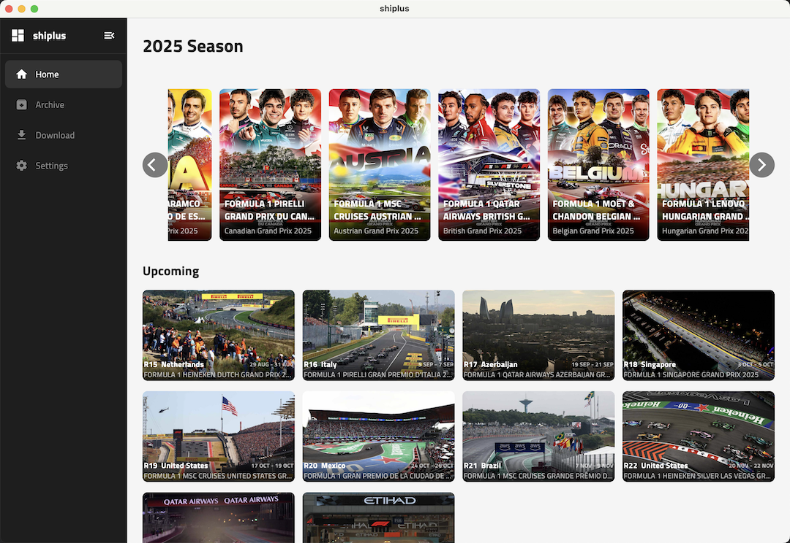
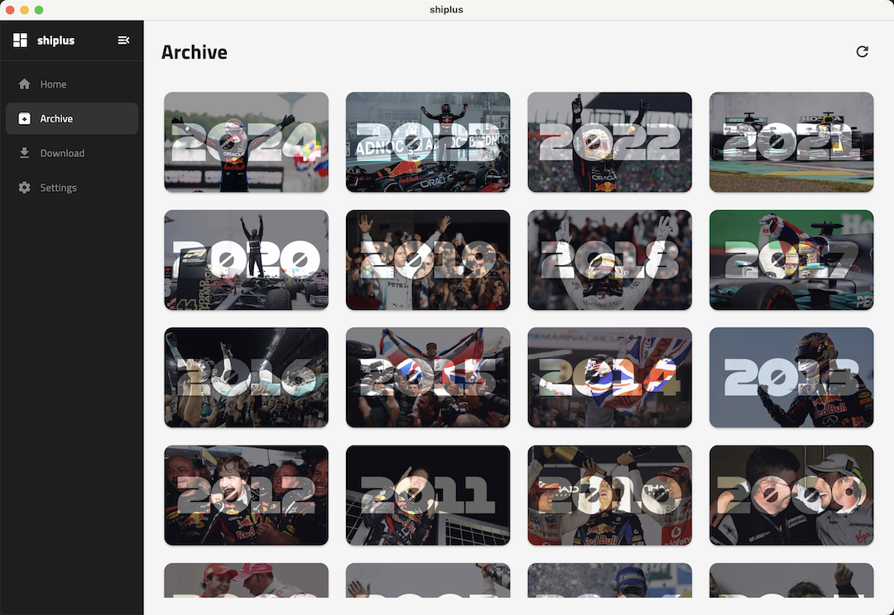
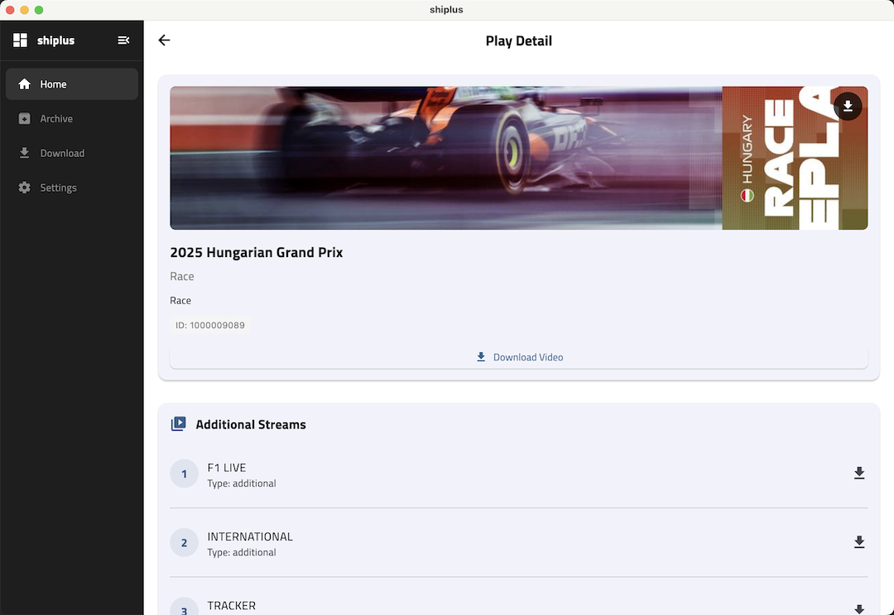
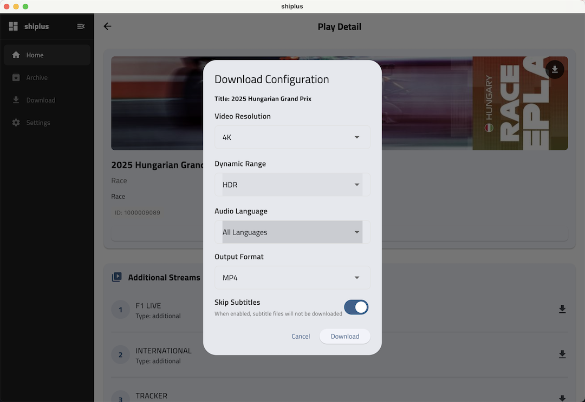
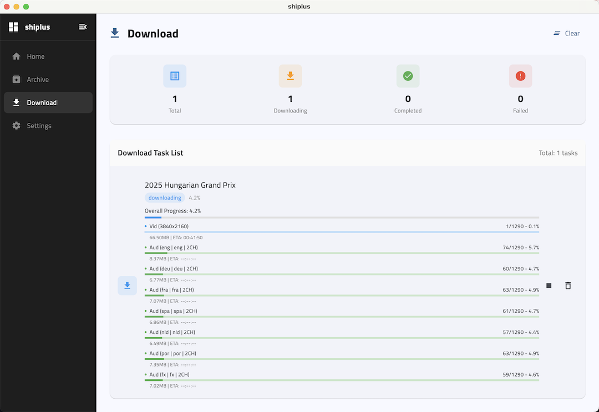
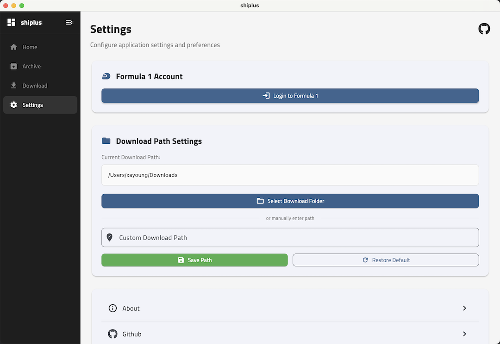

# shiplus

Cross-platform desktop app for downloading F1TV content. Requires active F1TV subscription.  
*Free, open-source, and unaffiliated with Formula 1.*

<div align="center">
  
  
  
</div>

## ✨ Features

- **Direct F1TV Integration**: Access content with your subscription
- **Multi-resolution Downloads**: When DRM is removed, you can download. Supports up to 4K HDR (2025 Season and F1TV Premium required)
- **Multi-Audio & Subtitles**: Combine audio tracks and subtitles
- **Format Options**: Output to MP4 or MKV containers
- **Native Performance**: Optimized for Windows & macOS


## 📸 Screenshots

<div align="center">
  
 
  
  

  
  
  
  
  

  
  
 
  
  

</div>


## 🔒 Security
- **Local Credential Storage**: Encrypted on-device only
- **Zero Data Collection**: No telemetry or analytics
- **Direct API Access**: Connects exclusively to official F1 servers

## 📋 System Requirements

### Windows
- Windows 10 or higher
- x64 architecture

### macOS
- macOS 11.0 or higher
- Apple Silicon

### Download Releases

https://github.com/xayoung/shiplus/releases


## ❤️ Sponsor

If you find this project useful, please consider supporting its development:

- [**GitHub Sponsors**](https://github.com/sponsors/xayoung)
- [**ko-fi**](https://ko-fi.com/xayoung)

Your support helps maintain and improve this project!

### ❤️ TODO
- [ ] Add support for iOS
- [ ] Add support for Android

## 🚀 Development Getting Started

### Development Requirements
- Flutter 3.35.1+
- Dart 3.9.0+
- Platform-specific development tools (see platform requirements below)

### Installing Dependencies
```bash
flutter pub get
```

### Running the Application
```bash
# Debug mode
flutter run -d windows  # Windows
flutter run -d macos    # macOS

# Release mode
flutter run --release -d windows
flutter run --release -d macos
```

### Acknowledgements  
- [**F1AppleTV**](https://github.com/NoahFetz/F1AppleTV/)

## 📄 License

This project is licensed under the GPL License - see the [LICENSE](LICENSE) file for details.

## ⚠️ Disclaimer

This application is unofficial and is not associated in any way with the Formula 1 companies. F1, FORMULA ONE, FORMULA 1, FIA FORMULA ONE WORLD CHAMPIONSHIP, GRAND PRIX and related marks are trade marks of Formula One Licensing B.V.